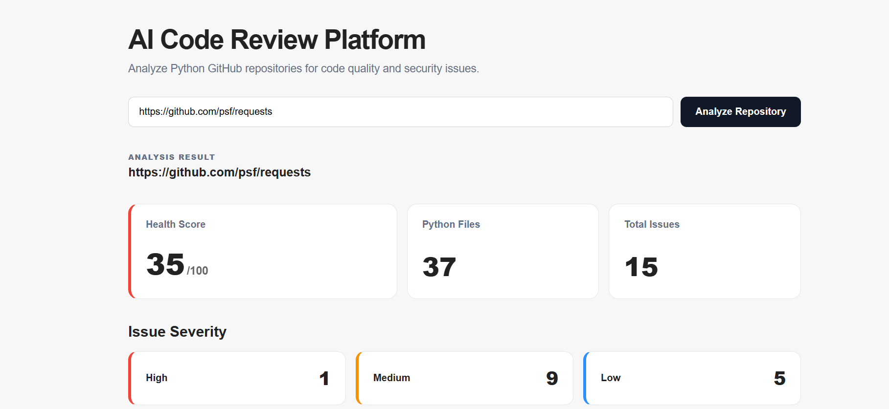
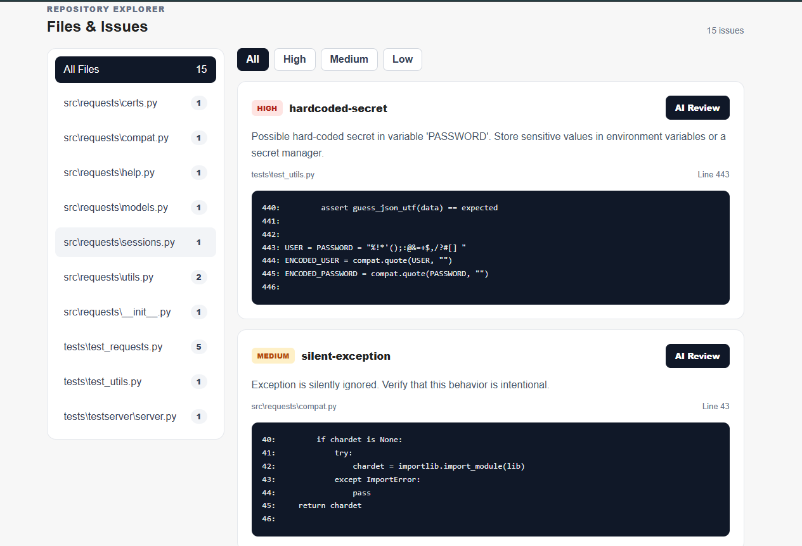
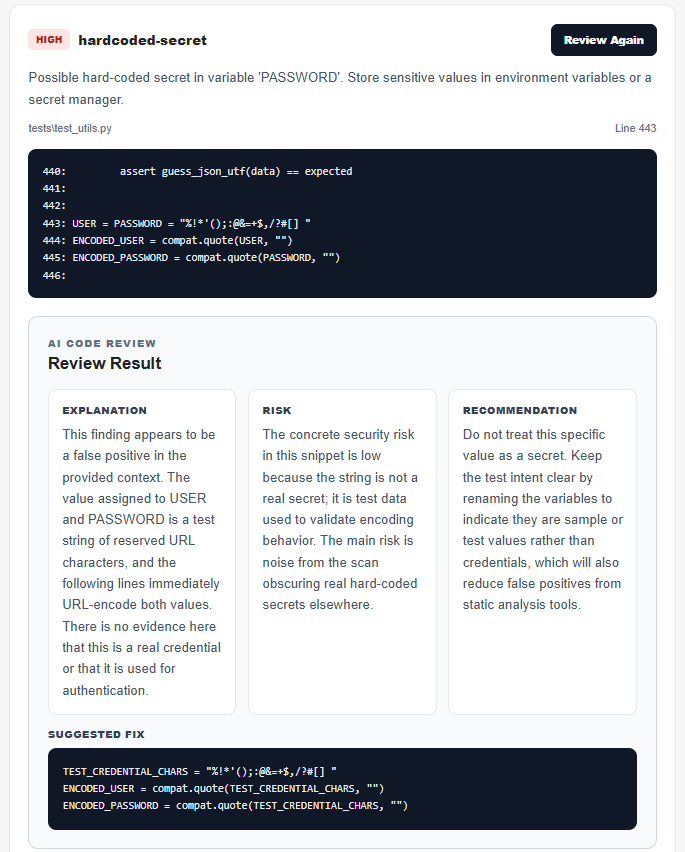

# AI Code Review Platform

An AI-powered code review platform that analyzes Python GitHub repositories, detects code-quality and security issues, and generates contextual AI explanations and suggested fixes.

The platform combines **AST-based static analysis**, a **FastAPI backend**, an interactive **React dashboard**, automated testing, and **AI-powered code review**.

---

## Overview

AI Code Review Platform allows developers to submit the URL of a public GitHub repository and automatically analyze its Python codebase.

The platform clones the repository, discovers Python files, parses the source code using Python's Abstract Syntax Tree (AST), detects potential code-quality and security issues, assigns severity levels, calculates a repository health score, and displays the results through an interactive web dashboard.

For individual findings, developers can request an AI-powered review that uses the relevant source-code context to explain the issue, describe its risk, recommend an improvement, and suggest a possible code fix.

---

## Demo

### Repository Analysis Dashboard



### File & Issue Explorer



### AI-Powered Code Review



---

## Features

### Repository Analysis

- Clone and analyze public GitHub repositories
- Automatically discover Python source files
- Parse Python code using the built-in AST module
- Extract functions, classes, methods, and imports
- Analyze an entire repository through a REST API
- Remove temporary cloned repositories after analysis

### Static Code Analysis

The analyzer currently detects:

- Bare `except` blocks
- Silent exception handling
- Debugging `print()` statements
- Dangerous `eval()` usage
- Dangerous `exec()` usage
- `subprocess` calls using `shell=True`
- Potential hard-coded secrets

Each detected issue includes:

- Rule name
- Severity
- Severity score
- Line number
- Description
- Relevant source-code context

### Repository Health Score

The platform calculates a repository health score from **0 to 100** based on detected issues and their severity.

This provides a quick repository-level indication of code quality and potential risk.

> The health score is a heuristic designed to summarize analyzer findings and should not be interpreted as a formal security rating.

### AI-Powered Code Review

Each detected issue can be reviewed individually using AI.

The AI receives the issue metadata together with a small section of relevant source code and generates:

- **Explanation** — why the issue matters
- **Risk** — the potential impact
- **Recommendation** — how the code can be improved
- **Suggested Fix** — an example of corrected code

AI reviews are generated only when explicitly requested by the user.

### Interactive Dashboard

The React frontend provides:

- GitHub repository analysis form
- Repository health score
- Python file count
- Total detected issue count
- High, medium, and low severity summaries
- File and issue explorer
- Severity filtering
- Source-code context display
- On-demand AI reviews
- AI-generated fix suggestions
- Loading and error states

---

## Tech Stack

### Backend

- **Python 3.12**
- **FastAPI**
- **Python AST**
- **Pydantic**
- **OpenAI API**
- **Pytest**
- **Git**
- **Uvicorn**

### Frontend

- **React**
- **Vite**
- **JavaScript**
- **CSS**

---

## Architecture

```text
                 GitHub Repository
                        |
                        v
                 Repository Clone
                        |
                        v
              Python File Discovery
                        |
                        v
                AST Static Analysis
                        |
             +----------+----------+
             |                     |
             v                     v
      Structure Extraction    Issue Detection
             |                     |
             |              Severity Classification
             |                     |
             |              Code Context Extraction
             |                     |
             +----------+----------+
                        |
                        v
                 FastAPI Backend
                        |
              +---------+---------+
              |                   |
              v                   v
       Health Score        React Dashboard
                                  |
                                  v
                         File / Issue Explorer
                                  |
                                  v
                           AI Review Request
                                  |
                                  v
                            OpenAI API
                                  |
                                  v
                     Explanation + Risk +
                  Recommendation + Suggested Fix
```

---

## Project Structure

```text
ai-code-review-platform/
├── backend/
│   ├── __init__.py
│   ├── ai_reviewer.py
│   ├── analyzer.py
│   ├── main.py
│   └── models.py
│
├── frontend/
│   ├── public/
│   ├── src/
│   │   ├── assets/
│   │   ├── App.css
│   │   ├── App.jsx
│   │   ├── index.css
│   │   └── main.jsx
│   ├── .env.example
│   ├── package.json
│   └── vite.config.js
│
├── tests/
│   └── test_analyzer.py
│
├── screenshots/
│   ├── dashboard.png
│   ├── issue-explorer.png
│   └── ai-review.png
│
├── .gitignore
├── requirements.txt
└── README.md
```

---

## API

FastAPI automatically provides interactive API documentation through Swagger UI.

When the backend is running:

```text
http://127.0.0.1:8000/docs
```

### Health Check

```http
GET /
```

Example response:

```json
{
  "message": "AI Code Review Platform is running"
}
```

---

### Analyze Repository

```http
POST /analyze
```

Example request:

```json
{
  "repo_url": "https://github.com/psf/requests"
}
```

The endpoint:

1. Clones the repository
2. Discovers Python files
3. Parses the files using AST
4. Extracts code structure
5. Detects potential issues
6. Assigns severity and scores
7. Extracts relevant code context
8. Calculates the repository health score
9. Returns structured analysis results
10. Removes the temporary repository

Example response structure:

```json
{
  "repository": "https://github.com/psf/requests",
  "python_files_count": 37,
  "analyzed_files_count": 37,
  "health_score": 35,
  "summary": {
    "total_issues": 15,
    "severity_counts": {
      "high": 1,
      "medium": 9,
      "low": 5
    }
  },
  "top_issues": [],
  "files": []
}
```

---

### AI Review

```http
POST /ai-review
```

Example request:

```json
{
  "rule": "silent-exception",
  "severity": "medium",
  "line": 43,
  "message": "Exception is silently ignored. Verify that this behavior is intentional.",
  "code_context": "try:\n    load_module()\nexcept ImportError:\n    pass"
}
```

Example response structure:

```json
{
  "issue": {
    "rule": "silent-exception",
    "severity": "medium",
    "line": 43
  },
  "ai_review": {
    "explanation": "Explanation of why the issue matters.",
    "risk": "Description of the potential risk.",
    "recommendation": "Recommended improvement.",
    "suggested_fix": "Example corrected Python code."
  }
}
```

---

## Installation

### 1. Clone the Repository

```bash
git clone https://github.com/aseelmas/ai-code-review-platform.git
cd ai-code-review-platform
```

### 2. Create a Virtual Environment

```bash
python -m venv venv
```

Activate it on Windows:

```bash
venv\Scripts\activate
```

On macOS/Linux:

```bash
source venv/bin/activate
```

### 3. Install Backend Dependencies

```bash
pip install -r requirements.txt
```

### 4. Configure the OpenAI API Key

Create a `.env` file in the project root:

```env
OPENAI_API_KEY=your_openai_api_key
```

The `.env` file should never be committed to Git.

### 5. Run the Backend

```bash
uvicorn backend.main:app --reload
```

The backend will run at:

```text
http://127.0.0.1:8000
```

Swagger documentation:

```text
http://127.0.0.1:8000/docs
```

---

## Frontend Setup

Open another terminal:

```bash
cd frontend
npm install
```

The frontend supports configuration through:

```text
frontend/.env
```

Example:

```env
VITE_API_URL=http://127.0.0.1:8000
```

A configuration example is available in:

```text
frontend/.env.example
```

Run the development server:

```bash
npm run dev
```

Open the application at:

```text
http://localhost:5173
```

---

## Running Tests

Run the backend test suite from the project root:

```bash
python -m pytest -v
```

The automated tests cover:

- Issue detection rules
- Severity classification
- Issue scores
- Correct line-number detection
- False-positive edge cases
- Hard-coded secret detection
- Dangerous subprocess detection
- Repository health-score calculation
- Source-code context extraction

Frontend validation:

```bash
cd frontend
npm run lint
npm run build
```

---

## Example Analysis

The platform has been tested on the open-source Requests repository:

```text
https://github.com/psf/requests
```

An example analysis detected findings across multiple severity levels and displayed them through the repository dashboard and file explorer.

Users can inspect the source-code context of each finding and optionally request an AI-powered explanation and suggested fix.

> Static-analysis findings are heuristic. A detected issue does not necessarily represent a confirmed bug or security vulnerability and should be reviewed by a developer.

---

## Security and Privacy

The platform follows several practices to reduce unnecessary exposure of source code and credentials:

- API keys are stored using environment variables.
- `.env` files are excluded from Git.
- Temporary repository clones are removed after analysis.
- AI review is performed only when explicitly requested.
- The entire repository is not sent to the AI service.
- AI review requests contain only issue metadata and the relevant source-code context.

When analyzing proprietary or sensitive source code, users should review their organization's policies before sending code snippets to external AI services.

---

## Current Limitations

The static analyzer is intentionally lightweight and rule-based.

Current limitations include:

- Python repositories only
- Public GitHub repositories only
- Heuristic secret detection may produce false positives
- The health score is not normalized by repository size
- Static analysis cannot determine every runtime behavior
- AI-generated fixes should be reviewed before being applied

---

## Future Improvements

Potential future improvements include:

- Support for additional programming languages
- GitHub authentication for private repositories
- GitHub pull-request integration
- Automated pull-request review comments
- Configurable analysis rules
- Improved false-positive detection
- Repository-size-normalized health scoring
- Additional security rules
- Persistent analysis history
- User authentication
- Deployment and CI/CD integration

---

## Author

**Aseel Masarwa**

Computer Science Graduate from Ben-Gurion University of the Negev.

Interested in software engineering, backend development, and AI-powered developer tools.